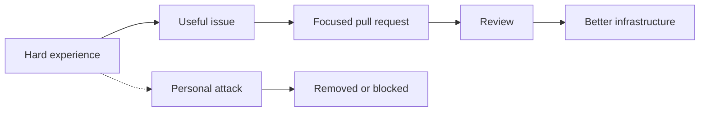

   
   
  

# Code of Conduct

Flareless exists to turn hard experience into useful infrastructure.

This project can have edge, urgency, and strong opinions. It cannot become a place for personal attacks.

> [!IMPORTANT]
> The project can be direct. The project cannot become personal. Critique the system, the design, the code, or the failure mode.

## Expected behavior

* Focus criticism on systems, designs, and code.
* Review with technical clarity.
* Assume contributors are here to build.
* Keep disagreements specific and actionable.
* Respect maintainers, reviewers, and new contributors.
* Help new contributors find a useful first task.

> [!TIP]
> A strong review explains what failed, why it matters, and what would make the change acceptable.

## Unacceptable behavior

* Personal attacks.
* Harassment.
* Threats.
* Publishing private information.
* Posting credentials or secrets.
* Deliberately misleading reviewers.
* Using the project to enable abuse.

> [!WARNING]
> Do not use Flareless issues, pull requests, discussions, or examples to post secrets, private customer material, exploit details, or personal information.

## Project tone

Hard feelings about broken systems are understandable.

Personal attacks are not.

Build, test, review, improve.

## Enforcement

Maintainers may edit, hide, or remove comments and contributions that violate this code. Repeat problems can lead to blocked participation.

The goal is not to make the project bland. The goal is to keep it useful.

> [!NOTE]
> Enforcement is about protecting the build. It is not about removing urgency, sharp technical criticism, or strong opinions.
