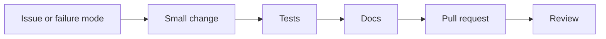

<p align="center">
  <a href="#working-style" title="Read the build first working style">
    
  </a>
  <a href="#pull-request-checklist" title="Read the pull request checklist">
    
  </a>
  <a href="./ARCHITECTURE.md#security-boundaries" title="Read provider neutrality and security boundaries">
    
  </a>
</p>

# Contributing

Flareless is built for people who want to turn hard experience into infrastructure.

Bring the systems knowledge. Bring the operational scars. Turn them into code, tests, documents, and reviews.

> [!NOTE]
> The best contribution explains the failure mode, adds a focused change, and proves the behavior with a test.

## Working style

* Build first.
* Keep pull requests small.
* Open an issue before large rewrites.
* Explain the failure mode you are solving.
* Add tests for routing, health, manifest, peer, and security behavior.
* Keep the project provider neutral.
* Do not add secrets, private credentials, or vendor internal material.



## What belongs here

Good contributions include:

* Route selection improvements.
* Health scoring and failover logic.
* Provider adapter improvements.
* Signed manifest and chunk validation work.
* Peer assisted delivery and WebRTC transport.
* Local simulation and test tooling.
* Clear architecture and protocol documentation.

> [!TIP]
> Useful work makes routing decisions more explainable, peer delivery safer, tests stronger, or the project easier for new builders to run.

## What does not belong here

Do not submit:

* Personal attacks.
* Vendor secrets or private documents.
* Credentials, API keys, tokens, or copied internal source.
* Abuse tooling.
* Code that hides the real behavior from reviewers.
* Vendor specific lock in presented as a neutral default.

> [!WARNING]
> Do not submit code or documentation that turns Flareless into an abuse platform, blind proxy, credential relay, or vendor locked system.

## First contribution path

1. Read `README.md`.
2. Read `ROADMAP.md`.
3. Run the local checks.
4. Pick a good first issue.
5. Keep the pull request focused.

## Local checks

```bash
npm install
npm test
go test ./...
go build ./...
```

To run the local edge runner:

```bash
npm run local
```

Then test:

```text
http://127.0.0.1:8787/health
http://127.0.0.1:8787/manifest?path=/video/test/v1/seg_00001.m4s
http://127.0.0.1:8787/peer/room-info?asset=test&peerId=peerA
```

To run the offline simulator:

```bash
npm run simulate
```

## Pull request checklist

Before opening a pull request, confirm:

* The change has a clear reason.
* Tests pass locally.
* CI should pass.
* New behavior is documented.
* Security sensitive behavior is explained.
* The change does not depend on a single provider.

> [!IMPORTANT]
> Provider neutrality is a project rule, not a preference. A provider adapter can be specific, but the default architecture should not depend on one vendor.

## Tone

Hard feelings about broken systems are understandable.

Personal attacks are not.

Build, test, review, improve.
