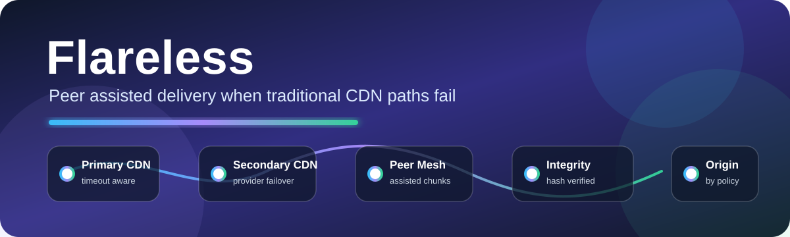
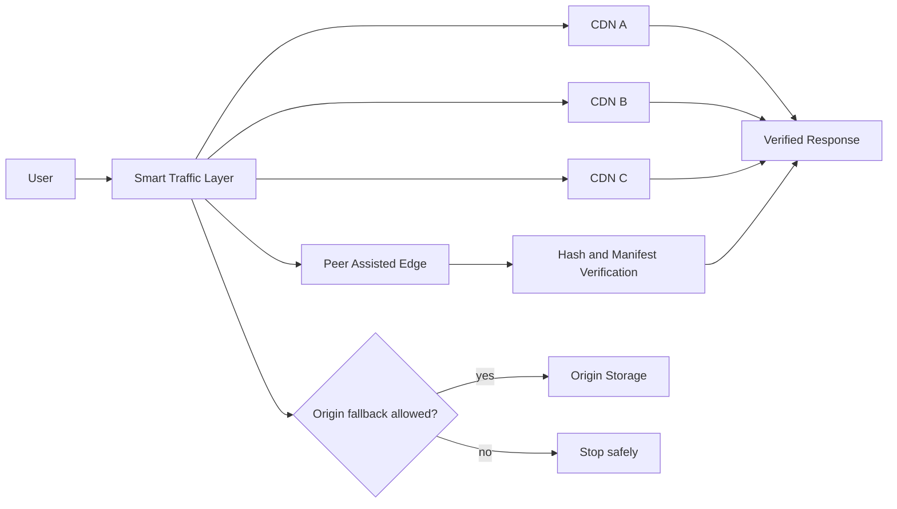
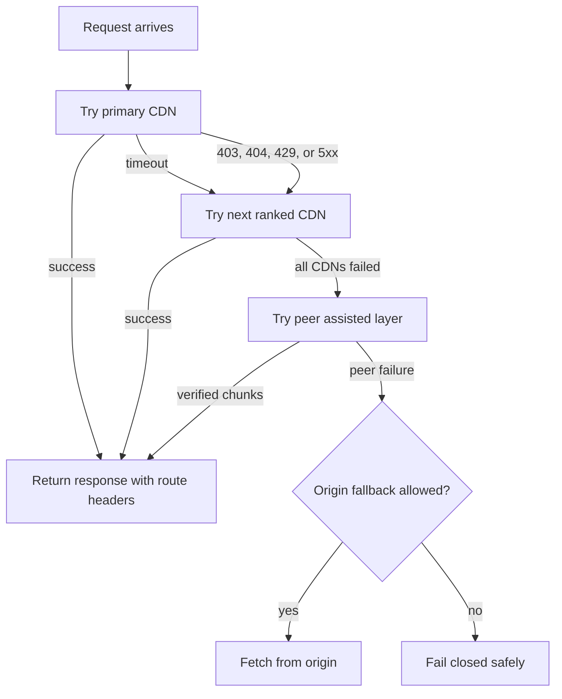

<p align="center">
  <a href="./ARCHITECTURE.md" title="Read the Flareless architecture">
    
  </a>
</p>

<p align="center">
  <a href="./ROADMAP.md" title="View the active prototype roadmap">
    
  </a>
  <a href="https://deerspotter.github.io/flareless/demo/" title="Open the live routing failure demo">
    
  </a>
  <a href="./ARCHITECTURE.md#peer-assisted-fallback" title="Read the peer assisted fallback architecture">
    
  </a>
  <a href="./SECURITY.md#peer-delivery-rules" title="Read the peer integrity verification rules">
    
  </a>
  <a href="./ARCHITECTURE.md#avoiding-a-new-single-point-of-failure" title="Read the scoped route policy and origin fallback model">
    
  </a>
</p>

# Flareless

Flareless is for the engineers who built the edge, kept it alive, carried the pager, solved the incidents, and then got told they were expendable.

This project gives that anger somewhere useful to go.

Not a rant. Not a boycott. Not a revenge repo.

A build.

An open source edge router and runtime for programmable request handling, multi CDN failover, provider neutral traffic control, and resilient internet delivery.

> [!IMPORTANT]
> Flareless does not treat peer delivery as blind fallback. Route policy, integrity checks, provider health, and failure scope decide what happens next.

> [!NOTE]
> The current public demo is static. It simulates CDN timeout behavior, HTTP status failover, peer assisted fallback, and policy controlled origin fallback without requiring a worker, backend, or paid hosting.

## Mobile Demo

[https://deerspotter.github.io/flareless/demo/](https://deerspotter.github.io/flareless/demo/)

The mobile demo is static and requires no worker, backend, or paid hosting. It simulates provider timeout, HTTP status failover, peer assisted fallback, and route policy behavior for origin fallback.

## Start Here

* `QUICKSTART.md` explains how to run the local runtime, tests, and simulator.
* `demo/` contains a no hosting mobile browser demo for timeout failover, HTTP failover, peer fallback, and origin fallback behavior.
* `ROADMAP.md` breaks the project into contributor ready modules.
* `MILESTONES.md` defines the build phases and exit criteria.
* `ARCHITECTURE.md` explains request flow, provider selection, health, manifests, and peer fallback.
* `modules/micro-cdn/README.md` explains the optional community micro CDN prototype.
* `CONTRIBUTING.md` explains how to contribute without needing private context.
* `SECURITY.md` explains trust boundaries, peer rules, provider routing rules, and secret handling.
* `CODE_OF_CONDUCT.md` keeps the project sharp without letting it become personal.

## Core Idea

Most websites depend on one edge provider for DNS, TLS, WAF, caching, routing, and DDoS protection. That creates a single operational and policy failure point.

Flareless separates those functions.



If one CDN fails, blocks traffic, rate limits the site, or becomes unreachable, traffic can route around it.

> [!WARNING]
> Origin fallback should remain policy controlled. A provider failure should not automatically bypass peer verification, route policy, or content ownership rules.

## Optional Micro CDN Module

Flareless also includes an optional micro CDN prototype under `modules/micro-cdn`.

The micro CDN module lets a node operator explicitly opt in to caching and serving approved public static files. It is not an exit node, not arbitrary proxying, and not private traffic inspection.

The current prototype supports:

```text
approve public content path
cache local file
verify SHA256
store cached bytes by hash
advertise content to coordinator
route by public /mcdn path
serve cached content from node
persist coordinator state
persist node manifest
delete cached content
unadvertise deleted content
```

The public path model is:

```text
/mcdn/{namespace}/{displayPath}
```

Example:

```text
/mcdn/demo/hello.txt
```

Internally, nodes store bytes by hash:

```text
cache/sha256/{first-two-hash-chars}/{full-sha256}
```

This keeps the user facing path readable while making the hash the source of truth.

## Current Build

```text
src/          Worker runtime prototype
services/     Go control plane scaffold
public/       Browser side peer logic
scripts/      Local runner and simulation tools
tests/        Node test suite
demo/         Static mobile browser demo
```

Local checks:

```bash
npm install
npm test
go test ./...
go build ./...
```

Local runner:

```bash
npm run local
```

Timeout failover demo:

```bash
npm run demo:timeout-failover
```

Expected demo result:

```text
cdn-a:PROVIDER_TIMEOUT
cdn-b:PROVIDER_SUCCESS
x-flareless-provider: cdn-b
x-flareless-reason: PROVIDER_TIMEOUT_FAILOVER
```

Simulator:

```bash
npm run simulate
```

Mobile browser demo:

```text
https://deerspotter.github.io/flareless/demo/
```

The demo is static and requires no worker, backend, or paid hosting. It simulates provider timeout, HTTP status failover, peer assisted fallback, and route policy behavior for origin fallback.

## Design Goals

* Multi CDN routing
* Provider independent origin storage
* Health based failover
* Versioned immutable content paths
* Client side video chunk fallback
* Optional peer assisted delivery
* Optional onion access for emergency reachability
* No single CDN control point
* Cloudflare style edge worker language without Cloudflare dependency

## Recommended Architecture

```text
Registrar
  |
Independent DNS
  |
Traffic Director
  |
  |---- CDN Provider A
  |---- CDN Provider B
  |---- CDN Provider C
  |
Object Storage Origin
  |
Versioned Content
  |
Optional Peer Assisted Layer
  |
Optional Onion Bootstrap
```

## Why Parallel CDNs

CDNs should not be chained.

Bad:

```text
User -> CDN A -> CDN B -> CDN C -> Origin
```

If CDN A fails, everything fails.

Good:

```text
User
  |---- CDN A
  |---- CDN B
  |---- CDN C
  |---- Peer Fallback
```

Each route is independent.

## Example Content Path

```text
/video/show-name/episode-001/v17/720p/chunk-0001.ts
```

Use versioned paths instead of overwriting live files.

## Failover Logic



Provider fetches are timeout aware. Each provider can define `timeoutMs`; when a provider does not answer before its deadline, Flareless records the timeout, marks that provider as failed, and tries the next ranked provider.

Successful routed responses include explanation headers:

```text
x-flareless-provider: cdn-b
x-flareless-route-id: route-id
x-flareless-reason: PROVIDER_TIMEOUT_FAILOVER
x-flareless-attempts: cdn-a:PROVIDER_TIMEOUT,cdn-b:PROVIDER_SUCCESS
```

## Health Check Signals

Each CDN route should be checked from multiple regions.

```text
DNS success
TLS success
HTTP status
Time to first byte
Chunk download speed
Error rate
Provider specific block response
```

## Edge Routing Flow

```text
Incoming request
  |
Check route health table
  |
Select best healthy CDN
  |
Rewrite request to selected provider
  |
Return response or redirect
```

## Security Model

Assume every external node can fail or behave maliciously.

Required controls:

* Hash verified chunks
* Signed manifests
* Provider independent TLS
* Rate limits
* Abuse reporting process
* Clear content ownership
* Origin access restrictions
* No private key sharing with peers

> [!CAUTION]
> Peer assisted delivery should only serve approved public content. It should not become an arbitrary proxy, exit node, or private traffic relay.

## License

MIT
