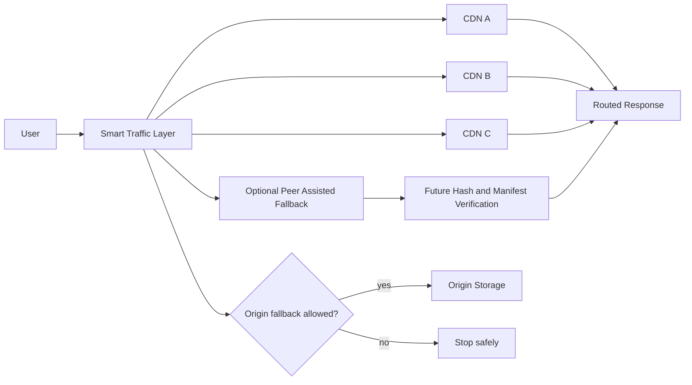

<p align="center">
  <a href="./ARCHITECTURE.md" title="Read the Flareless architecture">
    
  </a>
</p>

<p align="center">
  <a href="./ROADMAP.md" title="View the active prototype roadmap"></a><br>
  <a href="https://deerspotter.github.io/flareless/demo/" title="Open the live routing failure demo"></a><br>
  <a href="./tools/local-demo/README.md" title="Read the local command dashboard docs"></a><br>
  <a href="./SECURITY.md" title="Read the security model"></a>
</p>

# Flareless

Flareless is an open source edge routing and failover prototype for programmable request handling, multi CDN failover, provider neutral traffic control, and resilient public content delivery.

It is being built around one practical idea:

```text
One provider should not be the single operational control point for DNS, TLS, WAF, cache, routing, monitoring, and failover.
```

> [!IMPORTANT]
> Flareless is a prototype. It does not claim to be a production CDN, a production peer network, or a production control plane yet.

> [!NOTE]
> The public GitHub Pages demo is static. The richer command dashboard is the local Python demo under `tools/local-demo`.

## Current Status

This table is intentionally near the top so the repo stays honest about what exists now and what is still planned.

| Feature | Status |
| --- | --- |
| Static public demo | Implemented as simulation |
| Local Python command dashboard | Implemented |
| Embedded MapLibre dashboard map | Implemented |
| Manual scenario runner | Implemented |
| Provider timeout and status failover simulation | Implemented |
| Route trace object and evidence headers | Implemented |
| Agent recommendation inbox | Implemented |
| Operator approve / reject flow | Implemented |
| Metrics dashboard with custom widgets | Implemented |
| Host responsibility profiles | Implemented in local settings |
| Living topology view | Implemented as isolated SVG module |
| Topology drag, edit, snapshot, restore | Implemented |
| Agent Ops settings for free local / paid API marker | Implemented as local demo prep |
| Hosted locations setup registry | Implemented as local demo prep |
| Optional micro CDN trust model | MVP implemented |
| Real peer chunk transfer | Not implemented |
| Hash verified peer bytes | Not implemented |
| Detached manifest signatures | Not implemented |
| Distributed health checks | Not implemented |
| Durable production control plane | Not implemented |
| Automatic FTP/SFTP/cPanel/host apply | Not implemented |

## Local Command Dashboard

The main current workbench is the local command dashboard.

Run it from the repository root:

```text
tools/local-demo/start.bat
```

The local dashboard starts a Python server and opens an embedded MapLibre GUI. Startup is intentionally paused. Nothing polls and no scenario runs until the operator presses `Run`, `Refresh`, or `Live`.

The dashboard currently includes:

```text
Dashboard       MapLibre route map, provider cards, route reason, manual scenario controls
Traffic         Provider health and route attempts
Providers       Normalized provider health table
Policies        Visual IF / THEN policy preview
Builder         Custom failover chain builder with saved scenarios
Approvals       Agent recommendation inbox and operator decision flow
Peers           Micro CDN trust model and peer boundary information
Evidence        Generated x-flareless-* headers and route trace JSON
Replay          Route attempt replay
Incidents       Incident timeline generated from route and operator events
Metrics         Cockpit style metrics, host responsibility, and custom widgets
Topology        Isolated SVG topology with drag, edit, snapshot, restore
History         Locally persisted run history
Logs            Route trace and audit output
Settings        Health settings, agents, hosted locations, and server behavior
```

The local dashboard files live here:

```text
tools/local-demo/ui/index.html
tools/local-demo/ui/styles.css
tools/local-demo/ui/app.js
tools/local-demo/ui/cockpit_topology.js
tools/local-demo/ui/agent_hosting_ui.js
tools/local-demo/ui/host_profiles_metrics.js
tools/local-demo/webview_console.py
tools/local-demo/server.py
```

Read the local dashboard documentation:

[tools/local-demo/README.md](./tools/local-demo/README.md)

## Stable UI Baseline

The current stable UI baseline is backed up here:

[baseline-2026-06-17-map-topology-stable](https://github.com/DeerSpotter/flareless/tree/baseline-2026-06-17-map-topology-stable)

That baseline preserves the point where the Dashboard MapLibre map and the Topology SVG module are separated. Future UI work should avoid mixing MapLibre initialization with optional topology or widget modules.

## Mobile Static Demo

[https://deerspotter.github.io/flareless/demo/](https://deerspotter.github.io/flareless/demo/)

The mobile demo is static and requires no worker, backend, or paid hosting. It simulates provider timeout, HTTP status failover, peer assisted fallback, and route policy behavior for origin fallback.

## Start Here

* [Quickstart](./QUICKSTART.md) explains how to run the local runtime, tests, and simulator.
* [Local Demo Console](./tools/local-demo/README.md) explains the Python command dashboard, MapLibre GUI, topology, metrics, hosts, Agent Ops, scenarios, and local persistence.
* [Mobile Demo](./demo/) contains a no hosting browser demo for timeout failover, HTTP failover, peer fallback, and origin fallback behavior.
* [Honest Feedback](./HONEST_FEEDBACK.md) is the current blunt project review.
* [Failure Point Tracking](./docs/failure-point-tracking.md) explains how Flareless records where a route broke.
* [Agent Recommendation Lifecycle](./docs/agent-recommendation-lifecycle.md) explains pending recommendations, operator approval, rejection, and audit logging.
* [Roadmap](./ROADMAP.md) breaks the project into contributor ready modules.
* [Milestones](./MILESTONES.md) defines the build phases and exit criteria.
* [Architecture](./ARCHITECTURE.md) explains request flow, provider selection, health, manifests, and peer fallback.
* [Optional Micro CDN Module](./modules/micro-cdn/README.md) explains the optional community micro CDN prototype.
* [Micro CDN Trust Model](./modules/micro-cdn/TRUST_MODEL.md) explains approval manifests, route reason codes, and untrusted node boundaries.
* [Micro CDN Protocol Draft](./modules/micro-cdn/protocol.md) defines node registration, content registration, routing responses, and v1 constraints.
* [Contributing](./CONTRIBUTING.md) explains how to contribute without needing private context.
* [Security](./SECURITY.md) explains trust boundaries, peer rules, provider routing rules, and secret handling.
* [Code of Conduct](./CODE_OF_CONDUCT.md) keeps the project sharp without letting it become personal.

## Core Idea

Most websites depend on one edge provider for DNS, TLS, WAF, caching, routing, and DDoS protection. That creates a single operational and policy failure point.

Flareless separates those functions.



If one CDN fails, blocks traffic, rate limits the site, or becomes unreachable, traffic can route around it.

> [!WARNING]
> Origin fallback should remain policy controlled. A provider failure should not automatically bypass peer verification, route policy, or content ownership rules.

## Optional Micro CDN Module

Flareless includes an optional micro CDN prototype under `modules/micro-cdn`.

The micro CDN module lets a node operator explicitly opt in to caching and serving approved public static files. It is not an exit node, not arbitrary proxying, and not private traffic inspection.

The current prototype supports local approval metadata, SHA256 validation, cached bytes by hash, local coordinator state, route reason codes, disabled/offline node rejection, cached content serving, and cache deletion.

The public path model is:

```text
/mcdn/{namespace}/{displayPath}
```

Internally, nodes store bytes by hash:

```text
cache/sha256/{first-two-hash-chars}/{full-sha256}
```

This keeps the user facing path readable while making the hash the source of truth.

## Current Build

```text
src/                Worker runtime prototype
services/           Go control plane scaffold
public/             Browser side peer logic
scripts/            Local runner and simulation tools
tests/              Node test suite
demo/               Static mobile browser demo
tools/local-demo/   Python local command dashboard
modules/micro-cdn/  Optional micro CDN prototype
```

Local checks:

```bash
npm install
npm test
npm run demo:timeout-failover
npm run simulate -- --users=50 --segments=25 --requests=500 --seed=1337
npm run test:micro-cdn
python tools/local-demo/run_tests.py
go test ./...
go build ./...
```

## Example Route Evidence

Expected route evidence for a provider timeout failover:

```text
x-flareless-provider: cdn-b
x-flareless-reason: PROVIDER_TIMEOUT_FAILOVER
x-flareless-attempts: cdn-a:PROVIDER_TIMEOUT,cdn-b:PROVIDER_SUCCESS
x-flareless-failure-points: 1:PROVIDER_TIMEOUT:cdn-a:PROVIDER_TIMEOUT
x-flareless-route-trace: encoded routeTrace JSON
```

Route trace shape:

```text
routeTrace = {
  requestId,
  routeKey,
  policyId,
  attempts,
  failurePoints,
  selectedFallback,
  finalStatus
}
```

## Design Goals

* Multi CDN routing
* Provider independent origin storage
* Health based failover
* Versioned immutable content paths
* Client side video chunk fallback
* Optional peer assisted delivery
* Optional onion access for emergency reachability
* No single CDN control point
* Cloudflare style edge worker language without Cloudflare dependency
* Operator visible evidence before automated action

## Recommended Architecture

```text
Registrar
  |
Independent DNS
  |
Traffic Director
  |
  |---- CDN Provider A
  |---- CDN Provider B
  |---- CDN Provider C
  |
Object Storage Origin
  |
Versioned Content
  |
Optional Peer Assisted Layer
  |
Optional Onion Bootstrap
```

## Why Parallel CDNs

CDNs should not be chained.

Bad:

```text
User -> CDN A -> CDN B -> CDN C -> Origin
```

If CDN A fails, everything fails.

Good:

```text
  |---- CDN A
  |---- CDN B
  |---- CDN C
  |---- Peer Fallback
```

Each route is independent.

## Security Model

Assume every external node can fail or behave maliciously.

Required controls:

* Hash verified chunks
* Signed manifests
* Provider independent TLS
* Rate limits
* Abuse reporting process
* Clear content ownership
* Origin access restrictions
* No private key sharing with peers
* No automatic host file changes without backup, diff preview, and explicit operator approval

> [!CAUTION]
> Peer assisted delivery should only serve approved public content. It should not become an arbitrary proxy, exit node, or private traffic relay.

## License

MIT
