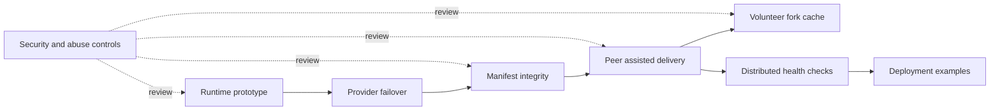

   
   
   
   
  

# Roadmap

Flareless is being built as a provider neutral edge runtime and routing system. The goal is to route around outages, provider lock in, policy failures, degraded networks, and single vendor control.

This roadmap splits the project into modules so contributors can join without needing private context.

> [!NOTE]
> The roadmap is organized by contribution track. Each track should explain its purpose, inputs, outputs, current status, beginner tasks, and advanced tasks.

## Current tracks

### Runtime prototype

Path: `src/`

Purpose: Request handling, route selection, provider failover, manifest generation, and peer fallback responses.

Input: Incoming HTTP requests, provider configuration, manifest data, health state, and peer availability.

Output: Routed responses, failover decisions, generated manifests, and peer fallback responses.

Status: Active prototype.

Beginner tasks:

* Add route selector test cases for degraded providers.
* Add manifest examples for common video chunk paths.
* Improve provider configuration validation.

Advanced tasks:

* Add pluggable route policies.
* Add signed manifest verification.
* Add deterministic reason codes for every routing decision.

### Control plane scaffold

Path: `services/`

Purpose: Future services for health checks, route scoring, observability, and distributed control.

Input: Provider probe targets, runtime health reports, node reports, and route scoring configuration.

Output: Structured health results, route scores, observability data, and control plane APIs.

Status: Early Go scaffold.

Beginner tasks:

* Return structured JSON from the health check service.
* Add timeout configuration to probes.
* Add tests around route selection.

Advanced tasks:

* Add multi region probe aggregation.
* Add historical health windows.
* Add route scoring APIs consumed by the runtime.

### Peer assisted delivery

Paths: `public/`, `src/peer/`, `scripts/simulate-network.mjs`

Purpose: Peer fallback for immutable chunks when CDN routes are unavailable or degraded.

Input: Immutable chunk requests, peer availability, manifest hashes, and CDN failure signals.

Output: Verified chunk responses, peer fallback attempts, simulator results, and peer health decisions.

Status: Scheduler and simulator exist. WebRTC transport is still open.

Beginner tasks:

* Add simulator scenarios for full CDN failure.
* Add peer cooldown tests.
* Add invalid chunk rejection examples.

Advanced tasks:

* Implement WebRTC data channel chunk transfer.
* Add peer trust scoring.
* Add bandwidth aware upload limiting.

> [!IMPORTANT]
> Peer assisted delivery should stay integrity led. The project should prove the chunk first, then care about speed.

### Manifest and content integrity

Path: `src/mgp/`

Purpose: Define how assets, chunks, provider URLs, hashes, and signatures are represented.

Input: Asset paths, provider URLs, chunk metadata, hashes, generated time, and optional signature metadata.

Output: Versioned manifests, normalized content paths, integrity metadata, and verification inputs.

Status: Basic manifest generation exists. Signed verification is not complete.

Beginner tasks:

* Add `manifest.schema.json`.
* Add example manifests under `examples/`.
* Add tests for path normalization.

Advanced tasks:

* Add signature verification.
* Add chunk hash validation.
* Add key rotation design.

### Provider adapter layer

Path: `src/routing/providerFetch.js`

Purpose: Translate incoming requests into provider specific fetches while preserving safe headers and routing metadata.

Input: Selected provider, request path, query string, safe request headers, timeout policy, and routing metadata.

Output: Provider fetch requests, normalized provider responses, provider failure signals, and preserved path behavior.

Status: Basic adapter exists.

Beginner tasks:

* Add provider config examples.
* Add provider timeout handling.
* Add tests for query string preservation.

Advanced tasks:

* Add per provider auth strategies.
* Add provider specific block detection.
* Add retry budgets and circuit breaker behavior.

### Volunteer fork cache

Path: `docs/future-work/volunteer-fork-cache.md`

Purpose: Explore an optional recovery layer where supporter GitHub forks publish verified static mirrors through GitHub Pages.

Input: Official signed manifest, signed mirror registry, immutable public assets, volunteer fork Pages URLs, and mirror health state.

Output: Verified recovery routes, rejected mirror reasons, mirror health state, and demo behavior for public static site recovery.

Status: Future work research added. Implementation is not started.

Beginner tasks:

* Add a `Help cache this site` demo panel.
* Add a fake volunteer fork name generator.
* Add example `manifest.flareless.json` and `mirrors.json` files.

Advanced tasks:

* Add signed mirror registry verification.
* Add `scripts/verify-mirror.mjs` for GitHub Pages mirrors.
* Add scheduled mirror health checks.

> [!WARNING]
> Volunteer fork mirrors should never be trusted directly. They should only serve public static assets that match the official signed manifest.

### Security and abuse controls

Paths: `SECURITY.md`, future `src/security/`

Purpose: Keep the system useful without becoming an abuse platform.

Input: Trust boundaries, content approval rules, peer behavior, provider routing rules, and reported abuse cases.

Output: Security policy, enforcement checks, rejected unsafe behavior, and contributor guidance.

Status: Policy document first. Enforcement modules later.

Beginner tasks:

* Document threat scenarios.
* Add abuse reporting guidance.
* Add test cases for disallowed peer trust shortcuts.

Advanced tasks:

* Add signed content enforcement.
* Add peer reputation penalties.
* Add origin access control rules.

> [!WARNING]
> Security work should make abuse harder and review easier. It should not hide real behavior from maintainers or users.

## Priority sequence

1. Make the repo easy to clone, test, and understand.
2. Protect the Worker runtime with CI.
3. Define the architecture and module boundaries.
4. Implement signed manifests and content verification.
5. Harden provider failover.
6. Build WebRTC chunk transport.
7. Prototype volunteer fork cache verification.
8. Add distributed health checks.
9. Add production deployment examples.

## Definition of ready

A module is ready for broad contribution when it has:

* A clear purpose.
* A documented input and output.
* At least one test file.
* At least one good first issue.
* A maintainer note describing what should not be changed yet.

## Definition of done

A contribution is done when it:

* Builds locally.
* Passes CI.
* Adds or updates tests.
* Documents any new protocol behavior.
* Does not add vendor secrets or private credentials.
* Keeps the project provider neutral.

> [!TIP]
> A finished contribution should make Flareless easier to test, safer to run, or clearer to explain.