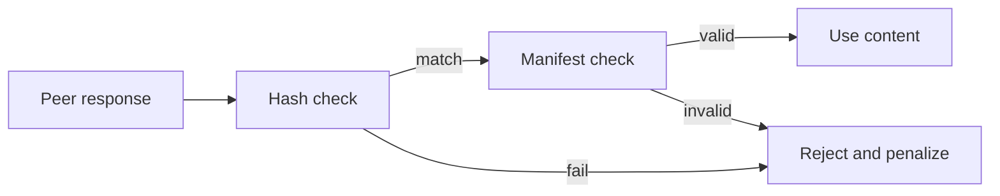
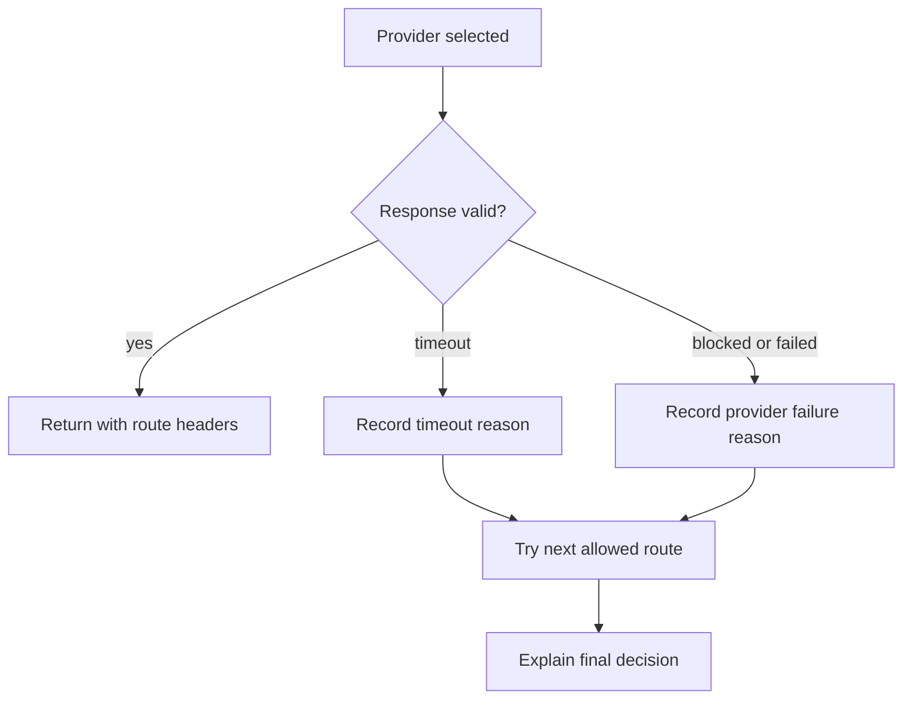

  
  
  
  

# Security

Flareless is a routing and resilience project. It is not a bypass tool, abuse platform, or piracy system.

> [!IMPORTANT]
> Flareless should assume providers can fail, peers can lie, and fast responses are not trustworthy until content integrity is proven.

## Security principles

* Treat every provider as fallible.
* Treat every peer as untrusted.
* Verify content before use.
* Prefer immutable, versioned paths.
* Never share private keys with peers.
* Never commit credentials.
* Keep origin access restricted.
* Make failure behavior visible and reviewable.

## Peer delivery rules

Peer assisted delivery must only be used for content that can be independently validated.

A valid peer path should include:

* Immutable asset version.
* Expected chunk hash.
* Signed manifest.
* Range verification.
* Cooldown or penalty for invalid chunks.

A peer response should not be trusted because it is fast. Speed is only useful after integrity is proven.

> [!WARNING]
> Peer delivery must not become arbitrary proxying. Peers should only serve approved public content that can be verified independently.

## Provider routing rules

Provider failover should be explainable. Route decisions should eventually include reason codes such as:

* Healthy primary provider.
* Primary provider timeout.
* Provider returned a block status.
* Provider exceeded failure budget.
* Region bias selected alternate provider.
* Peer fallback required.

## Secrets policy

Do not commit:

* API keys.
* TLS private keys.
* Provider credentials.
* Origin tokens.
* Internal vendor documents.
* Private customer data.

If a secret is committed, rotate it immediately and remove it from history where practical.

> [!CAUTION]
> A committed secret should be treated as exposed. Removing it from the visible file is not enough by itself.

## Abuse prevention

This project should not be used to hide abuse, impersonate providers, distribute unauthorized content, or attack networks.

Security sensitive work needs extra review, especially changes involving:

* Signature verification.
* Peer trust scoring.
* WebRTC signaling.
* Origin authentication.
* Header forwarding.
* Provider authorization.
* Abuse reporting.

## Reporting vulnerabilities

Open a private security report through GitHub if available. If private reporting is not available, open a minimal public issue that describes the affected area without exploit details.

Include:

* Affected file or module.
* Expected behavior.
* Actual behavior.
* Impact.
* Suggested fix if known.

## Maintainer response goals

Security issues should be acknowledged quickly and fixed with clear tests when possible.
